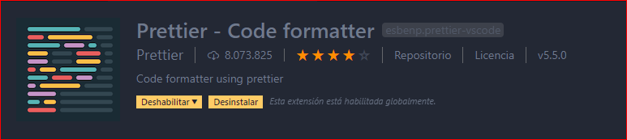

## 1_MiPrimerProyectoWeb

#### ENUNCIADO 
##### I. Instale y configure Visual Studio Code para su sistema operativo.

Para descargarlo dirijase al sitio de **[Visual Studio Code](https://code.visualstudio.com/)** y descargue la ultima actualizacion que se encuentre disponible en el sitio.

Localize el archivo descargado en el Explorador de Archivo de su equipo y proceda a abrir e instalar.

##### II. Instale las extensiones necesarias para poder trabajar de forma fácil

* Bracket Pair Colorizer

* CodeSnap

* Debugger for Chrome/Firefox/Microsoft Edge

* EsLint

* Live Share con Live Share Audio

* Markdown Preview

* Material Icon Theme

* Prettier

* Spanish Language Pack 

###### Las extenciones en VS Code se descargan e instalan aqui:

##### III. Instale y configure Git como control de versiones 

Para instalarlo dirijase al sitio de [GITHUB](https://git-scm.com/) visualize la ultima actualizacion que se encuentre en la pagina.

##### IV. Cree una cuenta en GitHub o GitLab

Git es una importante plataforma para alojar repositorios, por lo tanto es muy indispensable utlizarla. Para obtener una cuenta dirijirse al link de insiso anterior e ingresando los datos que se solicita en la pantalla del sitio.

##### V. Cree un proyecto vacío con toda la estructura de carpetas que correspondan a un proyecto web con HTML, CSS y JavaScript. 

Para iniciar un proyecto se utlizan los archivos de HTML, CSS y JavaScript los cuales pueden ser creados en VS Code o en el explorador de archivos del ordenador.

